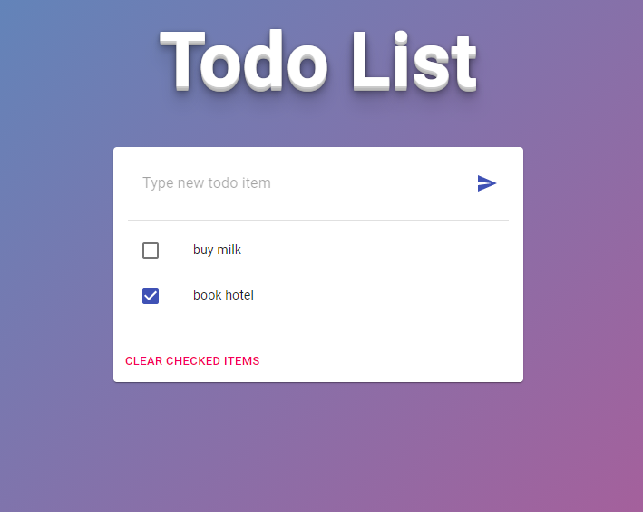

# Boilerplate App

This project is my goto boilerplate.

## Available Scripts

### npm start

Runs the app in the development mode.
Open http://localhost:8080 to view it in the browser.

The page will reload if you make edits.
You will also see any lint errors in the console.

### npm run build

Builds a static copy of your site to the `build/` folder.
Your app is ready to be deployed!

### npm run release

Updates project version and CHANGELOG file based on commit messages.

### npm test

Launches the application test runner.

### npm run test:coverage

Launches the application test runner and generates a code coverage report in `coverage/`.

### npm run cypress:open

Launches the cypress interactive test runner. 

### npm run cypress:run

Launches the cypress non interactive test runner. Recommended when running in the CI pipeline. 

## Tech

### App

Typescript, Snowpack, Material UI

### Testing

Jest, Cypress, React Testing Library

### Tooling

Lint staged, eslint, prettier, commit lint, standard-version

## Reference code

[Title CSS](https://codepen.io/ThatGuySam/pen/CytDA)

[Body Background CSS](https://codepen.io/P1N2O/pen/pyBNzX)

[Snowpack Typescript template](https://www.npmjs.com/package/@snowpack/app-template-react-typescript)